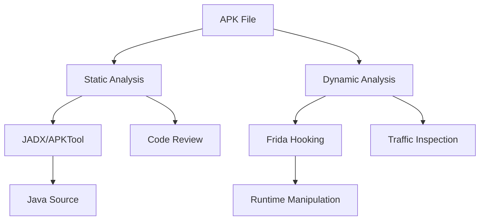
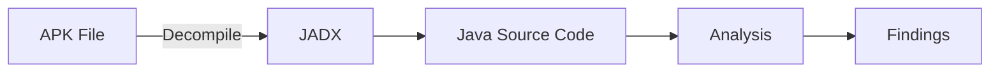
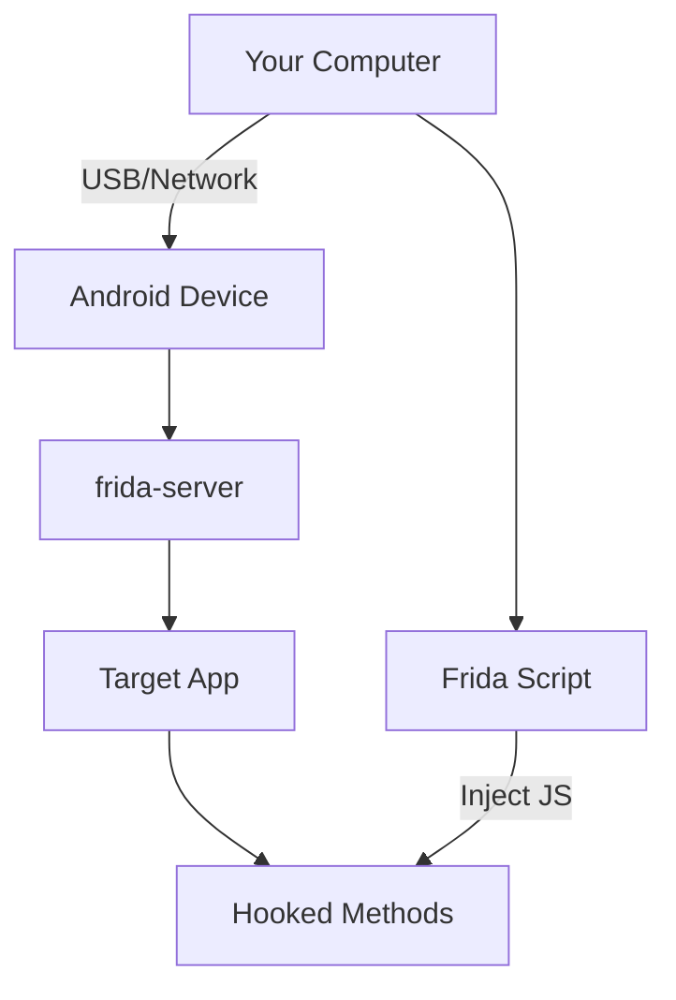

# Unmasking the App
## Reverse Engineering & Defense

<div class="pt-12 text-lg opacity-70">
  <p>Mobile Reverse Engineering & Security Seminar</p>
  <p class="mt-4 text-base">[Tên của bạn] - [Ngày tháng]</p>
</div>

<div class="pt-8">
  <span class="text-xl opacity-50">
    Nhấn Space để tiếp tục →
  </span>
</div>

---
layout: default
---

# Giới thiệu về Reverse Engineering

<div class="grid grid-cols-2 gap-4 mt-8">

<div>

## Tại sao cần Reverse Engineering?

- **Security Audit** 🔍
  - Phát hiện lỗ hổng bảo mật
  - Kiểm tra mã hóa và xác thực
  - Đánh giá rủi ro bảo mật

- **Malware Analysis** 🦠
  - Phân tích hành vi ứng dụng độc hại
  - Hiểu cơ chế tấn công
  - Phát triển biện pháp phòng thủ

</div>

<div>

## Các kỹ thuật chính



</div>

</div>

---
layout: two-cols
---

# Static Analysis với JADX

<div class="mt-4">

## Quy trình phân tích



</div>

::right::

## Những gì có thể tìm thấy

<div class="mt-4 space-y-3">

- **API Keys & Credentials** 🔑
  - Hardcoded trong source code
  - Trong strings.xml, BuildConfig
  - Trong native libraries

- **Logic Flaws** 🐛
  - Bypass authentication
  - Business logic vulnerabilities
  - Race conditions

- **Weak Cryptography** 🔓
  - Hardcoded encryption keys
  - Weak algorithms (MD5, DES)
  - Improper key management

</div>

<div class="mt-6">

```java
// Ví dụ: Hardcoded API Key
public class ApiConfig {
    private static final String API_KEY = "sk_live_1234567890";
    // ⚠️ Nguy hiểm: Key được hardcode
}
```

</div>

---
layout: default
---

# Traffic Inspection (The Basics)

<div class="grid grid-cols-2 gap-6 mt-6">

<div>

## Man-In-The-Middle (MITM)

<div class="mt-4 space-y-3">

**Khái niệm:**
- Chặn và kiểm tra traffic giữa app và server
- Xem được requests/responses không mã hóa
- Phân tích API endpoints và payloads

**Công cụ:**
- **Burp Suite** (Professional/Community)
- **Charles Proxy**
- **mitmproxy**

</div>

</div>

<div>

## Setup với Emulator

<div class="mt-4 space-y-2">

### Bước 1: Cấu hình Proxy
```
Burp Proxy: 127.0.0.1:8080
Emulator Settings → Proxy → Manual
```

### Bước 2: Cài đặt Certificate
```bash
# Export Burp Certificate
# Settings → Proxy → Import/Export CA Certificate

# Install trên emulator
adb push burp-cert.der /sdcard/
adb shell
su
mv /sdcard/burp-cert.der /system/etc/security/cacerts/
chmod 644 /system/etc/security/cacerts/burp-cert.der
```

### Bước 3: Trust Certificate
- Settings → Security → Install from storage
- Chọn burp-cert.der

</div>

</div>

</div>

<div class="mt-6 p-4 bg-gray-800 rounded">

⚠️ **Lưu ý:** Nhiều app sử dụng SSL Pinning để chống MITM. Cần bypass SSL Pinning trước khi có thể inspect traffic.

</div>

---
layout: default
---

# Giới thiệu về Frida

<div class="grid grid-cols-2 gap-6 mt-6">

<div>

## Dynamic Instrumentation

<div class="mt-4 space-y-3">

**Frida là gì?**
- Dynamic instrumentation toolkit
- Hook vào running processes
- Inject JavaScript vào native apps
- Không cần modify source code

**Cơ chế hoạt động:**
- Frida-server chạy trên device (rooted)
- Frida client trên máy tính
- Communication qua USB/Network

</div>

<div class="mt-6">



</div>

</div>

<div>

## Setup Frida

<div class="mt-4 space-y-3">

### 1. Cài đặt frida-server
```bash
# Download frida-server cho Android
wget https://github.com/frida/frida/releases/download/16.0.0/frida-server-16.0.0-android-arm64.xz

# Push lên device
adb push frida-server /data/local/tmp/
adb shell "chmod 755 /data/local/tmp/frida-server"
adb shell "su -c '/data/local/tmp/frida-server &'"
```

### 2. Cài đặt Frida client
```bash
pip install frida-tools
```

### 3. Verify connection
```bash
frida-ps -U
```

</div>

<div class="mt-6 p-4 bg-gray-800 rounded">

💡 **Tip:** Frida có thể hook cả Java/Kotlin methods và native (C/C++) functions

</div>

</div>

</div>

---
layout: default
---

# Demo 1: Bypassing SSL Pinning

<div class="grid grid-cols-2 gap-6 mt-4">

<div>

## Vấn đề

<div class="mt-4 space-y-2">

- App sử dụng SSL Pinning
- Burp Certificate không được trust
- Không thể intercept HTTPS traffic

**Giải pháp:** Hook vào certificate validation methods và force trust

</div>

<div class="mt-6">

## Script Frida

</div>

</div>

<div>

```typescript
// ssl-pinning-bypass.ts
Java.perform(function() {
    console.log("[*] Starting SSL Pinning Bypass...");
    
    // Hook X509TrustManager
    var X509TrustManager = Java.use("javax.net.ssl.X509TrustManager");
    var SSLContext = Java.use("javax.net.ssl.SSLContext");
    
    // Bypass checkClientTrusted
    var TrustManager = Java.registerClass({
        name: "com.example.TrustManager",
        implements: [X509TrustManager],
        methods: {
            checkClientTrusted: function(chain, authType) {},
            checkServerTrusted: function(chain, authType) {},
            getAcceptedIssuers: function() {
                return [];
            }
        }
    });
    
    // Hook OkHttp CertificatePinner (nếu app dùng OkHttp)
    try {
        var CertificatePinner = Java.use("okhttp3.CertificatePinner");
        CertificatePinner.check.overload('java.lang.String', 'java.util.List').implementation = function() {
            console.log("[+] Bypassed OkHttp CertificatePinner");
        };
    } catch(e) {
        console.log("[-] OkHttp not found");
    }
    
    // Hook TrustManagerImpl (Android internal)
    try {
        var TrustManagerImpl = Java.use("com.android.org.conscrypt.TrustManagerImpl");
        TrustManagerImpl.verifyChain.implementation = function() {
            console.log("[+] Bypassed TrustManagerImpl");
            return arguments[0]; // Return chain without verification
        };
    } catch(e) {
        console.log("[-] TrustManagerImpl not found");
    }
    
    console.log("[+] SSL Pinning bypassed!");
});
```

</div>

</div>

<div class="mt-4 p-4 bg-gray-800 rounded">

**Cách sử dụng:**
```bash
frida -U -f com.example.app -l ssl-pinning-bypass.ts --no-pause
```

</div>

---
layout: default
---

# Demo 2: In-App Purchase (IAP) Bypass

<div class="grid grid-cols-2 gap-6 mt-4">

<div>

## Mục tiêu

<div class="mt-4 space-y-2">

- Hook method kiểm tra premium status
- Force return `true` cho premium features
- Bypass payment verification

**Ví dụ:** App có method `isPremium()` kiểm tra trạng thái premium

</div>

<div class="mt-6">

## Phân tích

<div class="mt-3 space-y-2 text-sm">

1. Tìm class chứa method `isPremium()`
2. Hook method và force return `true`
3. Có thể hook cả Google Play Billing API

</div>

</div>

</div>

<div>

```typescript
// iap-bypass.ts
Java.perform(function() {
    console.log("[*] Starting IAP Bypass...");
    
    // Method 1: Hook isPremium() method
    try {
        var PremiumManager = Java.use("com.example.app.PremiumManager");
        
        PremiumManager.isPremium.overload().implementation = function() {
            console.log("[+] isPremium() called - returning true");
            return true; // Force premium
        };
        
        console.log("[+] Hooked PremiumManager.isPremium()");
    } catch(e) {
        console.log("[-] PremiumManager not found: " + e);
    }
    
    // Method 2: Hook Google Play Billing
    try {
        var BillingClient = Java.use("com.android.billingclient.api.BillingClient");
        
        // Hook purchase verification
        var Purchase = Java.use("com.android.billingclient.api.Purchase");
        Purchase.getPurchaseState.implementation = function() {
            var state = this.getPurchaseState();
            console.log("[+] Purchase state: " + state);
            // Return PURCHASED state (0)
            return 0;
        };
        
        console.log("[+] Hooked Google Play Billing");
    } catch(e) {
        console.log("[-] Google Play Billing not found");
    }
    
    // Method 3: Hook subscription check
    try {
        var SubscriptionManager = Java.use("com.example.app.SubscriptionManager");
        
        SubscriptionManager.isSubscribed.overload().implementation = function() {
            console.log("[+] isSubscribed() called - returning true");
            return true;
        };
        
        SubscriptionManager.hasActiveSubscription.overload('java.lang.String').implementation = function(planId) {
            console.log("[+] hasActiveSubscription(" + planId + ") - returning true");
            return true;
        };
        
        console.log("[+] Hooked SubscriptionManager");
    } catch(e) {
        console.log("[-] SubscriptionManager not found");
    }
    
    console.log("[+] IAP Bypass completed!");
});
```

</div>

</div>

<div class="mt-4 p-4 bg-gray-800 rounded">

**Cách sử dụng:**
```bash
# Attach vào running app
frida -U -f com.example.app -l iap-bypass.ts --no-pause

# Hoặc spawn app mới
frida -U com.example.app -l iap-bypass.ts
```

</div>

---
layout: default
---

# Protection & Defense (Cho Developers)

<div class="grid grid-cols-3 gap-4 mt-6">

<div class="p-4 bg-gray-800 rounded">

## 1. Code Obfuscation

<div class="mt-3 space-y-2 text-sm">

**ProGuard/R8:**
```groovy
android {
    buildTypes {
        release {
            minifyEnabled true
            shrinkResources true
            proguardFiles getDefaultProguardFile('proguard-android-optimize.txt'),
                         'proguard-rules.pro'
        }
    }
}
```

**DexGuard** (Commercial):
- Advanced obfuscation
- String encryption
- Control flow obfuscation

</div>

</div>

<div class="p-4 bg-gray-800 rounded">

## 2. Integrity Checks

<div class="mt-3 space-y-2 text-sm">

**Root Detection:**
```java
public boolean isRooted() {
    String[] paths = {"/system/app/Superuser.apk", 
                      "/sbin/su", "/system/bin/su"};
    for (String path : paths) {
        if (new File(path).exists()) return true;
    }
    return false;
}
```

**Frida Detection:**
```java
// Check for frida-server process
Process process = Runtime.getRuntime()
    .exec("ps | grep frida-server");
// Analyze output
```

**Anti-Debugging:**
- Check Debug.isDebuggerConnected()
- ptrace protection
- Timing checks

</div>

</div>

<div class="p-4 bg-gray-800 rounded">

## 3. Data Encryption

<div class="mt-3 space-y-2 text-sm">

**AES Encryption:**
```java
public String encrypt(String data, String key) {
    SecretKeySpec secretKey = new SecretKeySpec(
        key.getBytes(), "AES");
    Cipher cipher = Cipher.getInstance("AES/GCM/NoPadding");
    cipher.init(Cipher.ENCRYPT_MODE, secretKey);
    return Base64.encodeToString(
        cipher.doFinal(data.getBytes()), 
        Base64.DEFAULT);
}
```

**Best Practices:**
- Use hardware-backed keystore
- Key derivation (PBKDF2)
- Secure key storage

</div>

</div>

</div>

<div class="mt-6 p-4 bg-blue-900 bg-opacity-30 rounded">

## 🛡️ Defense in Depth Strategy

<div class="mt-3 grid grid-cols-2 gap-4 text-sm">

- **Multiple Layers:** Obfuscation + Integrity + Encryption
- **Server-side Validation:** Không trust client-side checks
- **Certificate Pinning:** Chống MITM attacks
- **Anti-Tampering:** Checksum verification, anti-debugging
- **Runtime Protection:** RASP (Runtime Application Self-Protection)
- **Code Signing:** Verify app integrity

</div>

</div>

---
layout: center
class: text-center
---

# Kết luận & Q&A

<div class="mt-12 space-y-6">

## Những điểm chính

<div class="grid grid-cols-2 gap-6 mt-6 text-left">

<div>

- ✅ Reverse Engineering là công cụ mạnh để audit security
- ✅ Static Analysis giúp tìm hardcoded secrets
- ✅ Dynamic Analysis với Frida cho phép runtime manipulation
- ✅ Traffic Inspection giúp hiểu API behavior

</div>

<div>

- 🛡️ Developers cần implement defense in depth
- 🛡️ Obfuscation làm khó reverse engineering
- 🛡️ Integrity checks phát hiện tampering
- 🛡️ Encryption bảo vệ sensitive data

</div>

</div>

</div>

<div class="mt-12 text-2xl">

## Cảm ơn! Questions?

</div>

<div class="mt-8 text-sm opacity-50">

Mobile Reverse Engineering & Security Seminar

</div>

